# Multimodal O-RAN RAG

**Enhancing 5G Architecture Comprehension with Large Language Models and Multimodal Retrieval-Augmented Generation**

*Atharva Nevasekar - UC Riverside, Department of Computer Science and Engineering*  
*Faculty Advisor: Dr. Zhaohui Tan*

---

## Symposium Poster

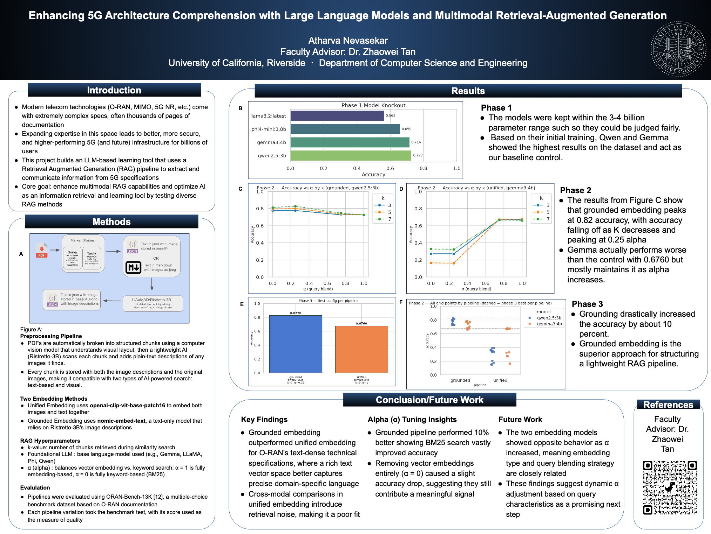

---

## Overview

Modern telecom standards (O-RAN, MIMO, 5G-NR) ship with extremely dense technical specifications, making it hard for engineers and researchers to extract relevant information quickly. This project builds an LLM-based Retrieval-Augmented Generation (RAG) pipeline that extracts and retrieves both text and visual information from O-RAN specs so downstream LLM workflows can answer technical questions with grounded context.

Two competing RAG strategies are benchmarked against [ORAN-Bench-13K](dataset/README.md), a 13K multiple-choice question dataset built from real O-RAN documentation:

| Pipeline | Embedding | Query Strategy |
|---|---|---|
| **Grounded** | `nomic-embed-text` (text-only, with AI-written image captions) | Hybrid BM25 + vector, blended by α |
| **Unified** | `multi2vec-clip` (joint image + text, image weight 0.6) | Auto-summarizes long queries, reranks by modality |

---

## Key Results

> All results on `dataset/fin_E.json` (easy split, ~1,145 questions).

| Phase | Winner | Config | Accuracy |
|---|---|---|---|
| Phase 1 - Model Knockout | `qwen2.5:3b` | grounded, k=3, α=0.75 | **72.8%** |
| Phase 2 - Grounded best | `qwen2.5:3b` | k=7, α=0.25 | **82.7%** |
| Phase 2 - Unified best | `gemma3:4b` | k=5, α=1.00 | **67.6%** |
| Phase 3 - Final head-to-head | Grounded | `qwen2.5:3b`, k=7, α=0.25 | **81.9%** |

**Grounded embedding beats unified by ~15 percentage points** for O-RAN's text-dense technical specs. The rich, domain-specific text vector space in the grounded pipeline captures precise terminology better than CLIP's joint embedding space. Cross-modal comparisons in the unified pipeline introduce retrieval noise that hurts accuracy.

---

## Results

### Phase 1 - Model Knockout

Four sub-4B models were evaluated on the grounded pipeline at fixed k=3, α=0.75 to select the top two for the full hyperparameter sweep.

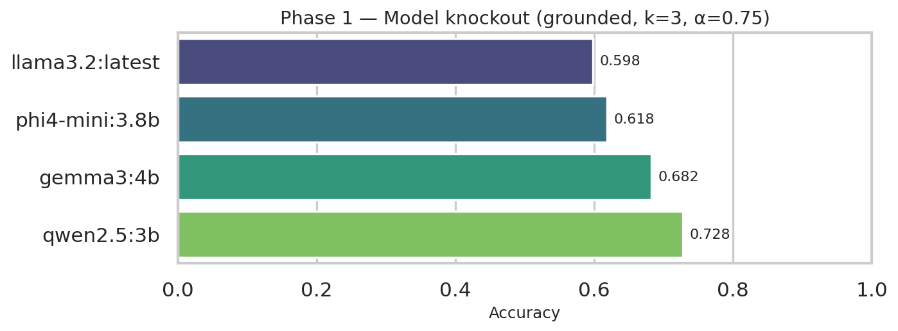

| Rank | Model | Accuracy | Carried Forward |
|---|---|---|---|
| 1 | `qwen2.5:3b` | 72.8% | ✓ |
| 2 | `gemma3:4b` | 68.2% | ✓ |
| 3 | `phi4-mini:3.8b` | 61.8% | |
| 4 | `llama3.2:latest` | 59.8% | |

`qwen2.5:3b` and `gemma3:4b` advanced to Phase 2. Both sit in the 3–4B parameter range so they are judged on a level footing.

---

### Phase 2 - Hyperparameter Grid (k × α)

Each pipeline was swept across k ∈ {3, 5, 7} and α ∈ {0.0, 0.25, 0.75, 1.0} for both models, yielding 24 configurations per pipeline.

**α (alpha)** controls the BM25 vs. vector blend in Weaviate hybrid search:
- `α = 0.0`: pure vector similarity
- `α = 0.25`: mostly vector, some BM25
- `α = 0.75`: mostly BM25, some vector
- `α = 1.0`: pure BM25 keyword

#### Grounded Pipeline Heatmaps (qwen2.5:3b and gemma3:4b)

<table><tr>
<td>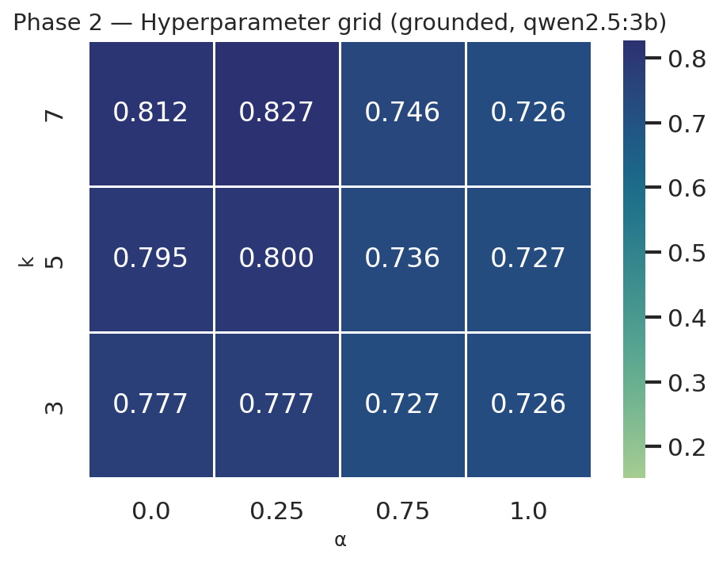</td>
<td>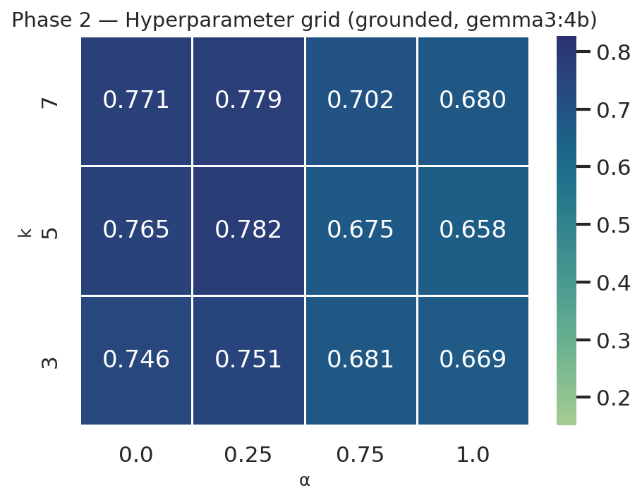</td>
</tr></table>

Peak accuracy of **82.7%** at k=7, α=0.25 for qwen2.5:3b. The sweet spot is a hybrid blend that favors vector search slightly. Pure BM25 (α=1.0) drops to ~72.6%, and more retrieved chunks (k=7) consistently outperform k=3.

#### Unified Pipeline Heatmaps (gemma3:4b and qwen2.5:3b)

<table><tr>
<td>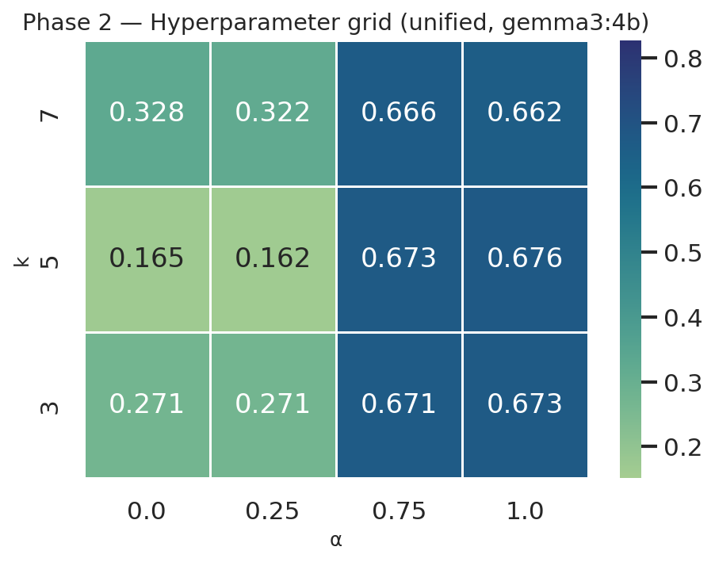</td>
<td>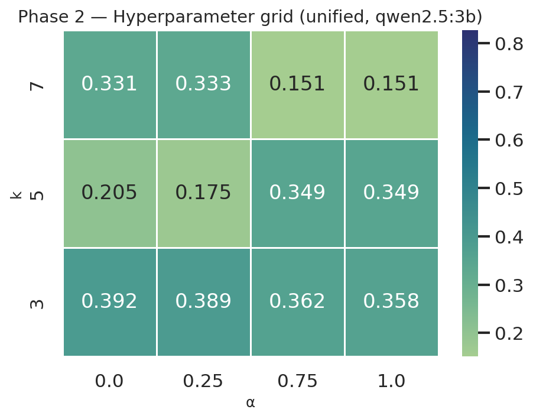</td>
</tr></table>

The unified pipeline with gemma3 peaks at **67.6%** (k=5, α=1.0). Unlike grounded, performance here is nearly flat across α. BM25 performs as well as vector for unified, suggesting the CLIP embeddings do not add meaningful signal for this domain. qwen2.5:3b collapses to 15–39% accuracy in the unified pipeline, making `gemma3:4b` the clear choice for unified retrieval.

#### Accuracy vs α - Grounded Pipeline

<table><tr>
<td>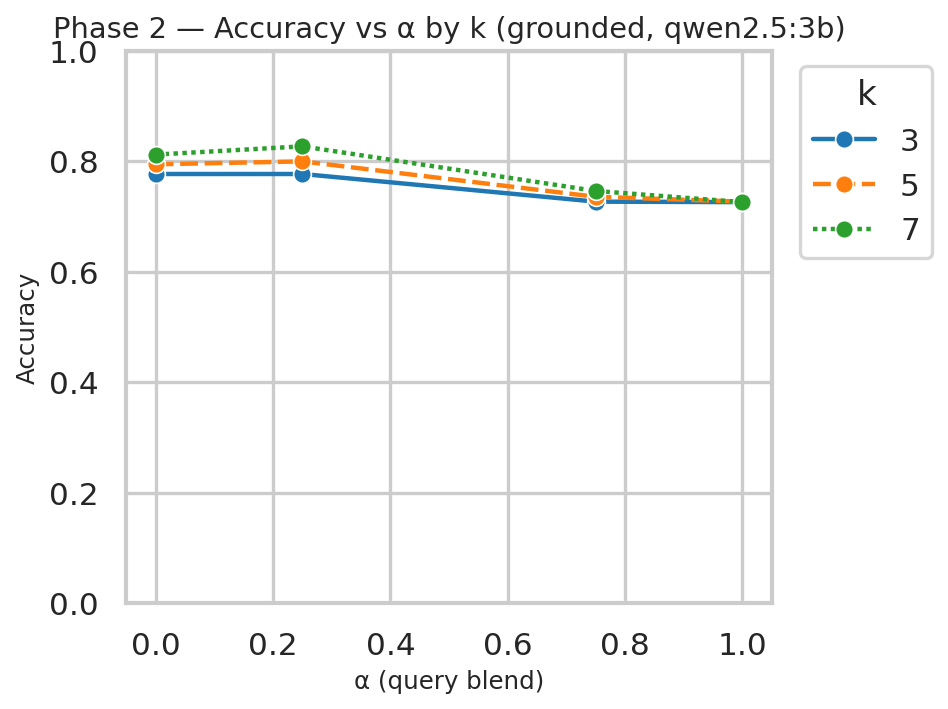</td>
<td>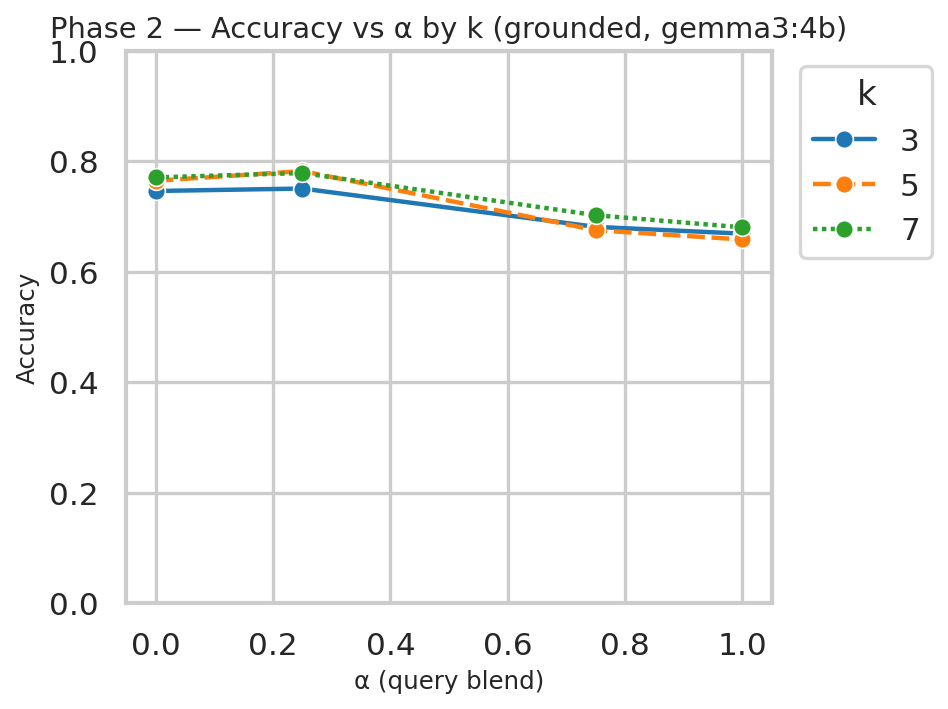</td>
</tr></table>

#### Accuracy vs α - Unified Pipeline

<table><tr>
<td>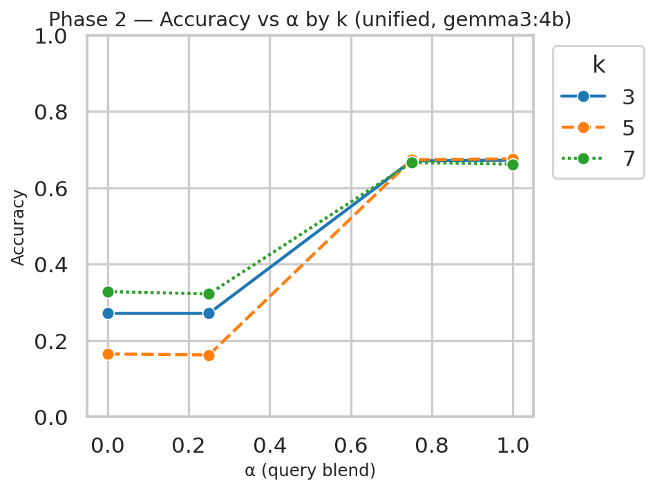</td>
<td>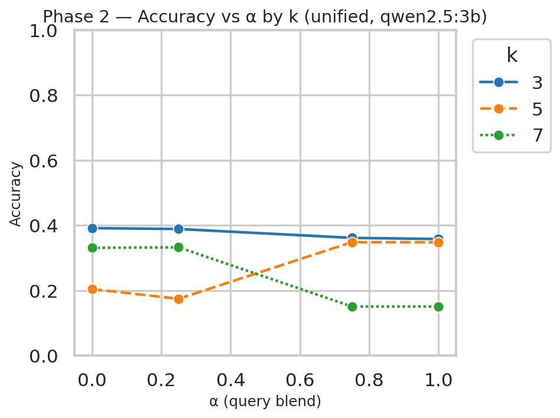</td>
</tr></table>

#### All Grid Points by Pipeline and Grounded vs Unified Scatter

<table><tr>
<td>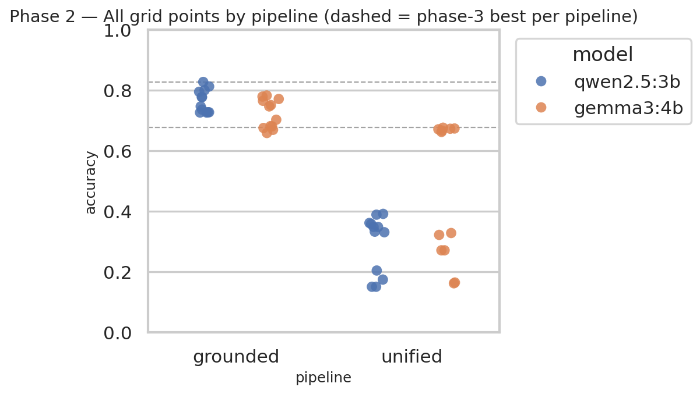</td>
<td>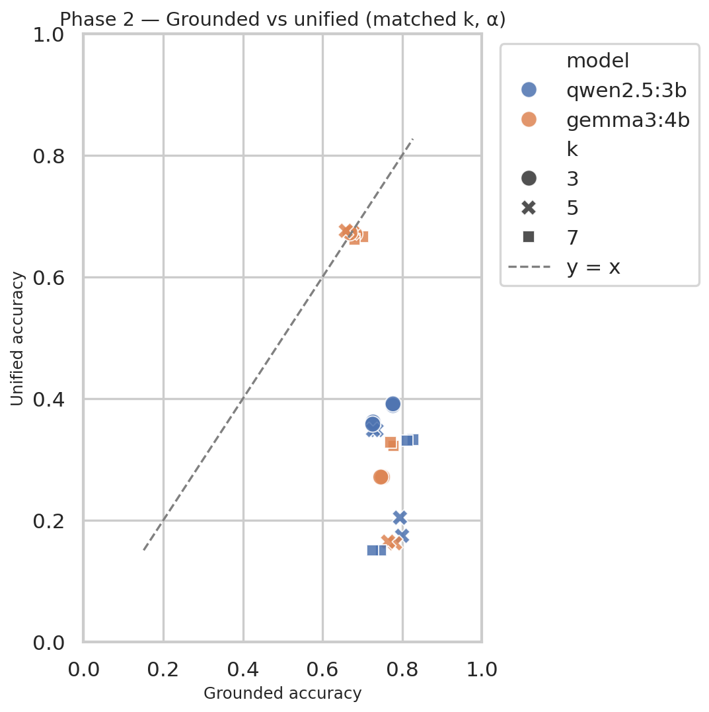</td>
</tr></table>

The strip plot shows every grounded configuration (73–83%) sitting well above the unified ceiling (~67% for gemma, ~40% for qwen). The scatter confirms grounded wins at every comparable (k, α) setting, with nearly all points falling below the y=x diagonal.

---

### Phase 3 - Final Pipeline Comparison

Each pipeline entered Phase 3 with its own Phase 2 best config for a clean head-to-head:

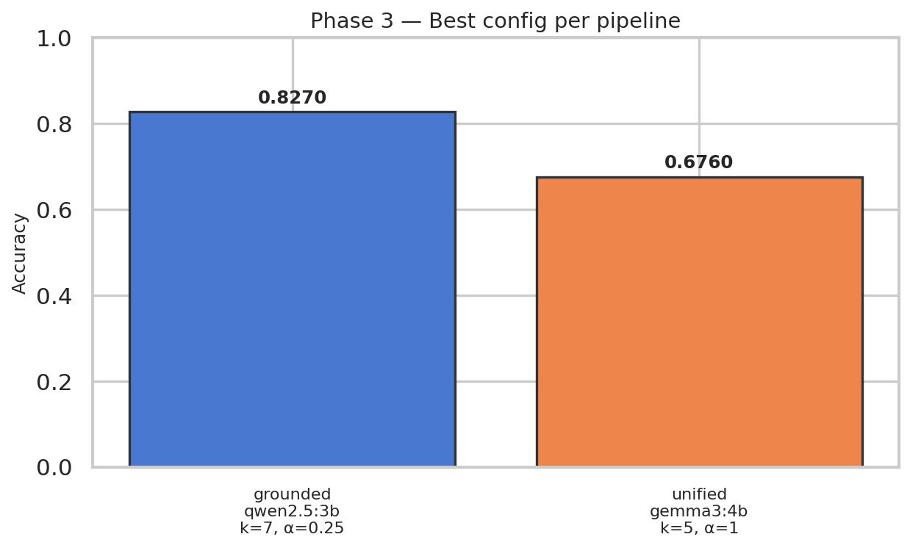

| Pipeline | Model | k | α | Accuracy |
|---|---|---|---|---|
| **Grounded** | `qwen2.5:3b` | 7 | 0.25 | **81.9%** |
| Unified | `gemma3:4b` | 5 | 1.00 | 67.4% |

**Grounded wins by 14.5 percentage points.** For O-RAN's text-dense technical specifications, a text-only embedding model with AI-written image captions outperforms joint image-text CLIP embeddings. The grounded approach preserves precise domain vocabulary that CLIP's general-purpose embedding space dilutes.

---

## Key Findings

**Grounded embedding is the superior approach for lightweight O-RAN RAG.**

- A hybrid α of 0.25 (mostly vector, some BM25) is optimal for grounded. Pure BM25 (α=1.0) drops accuracy by ~10 points, and pure vector (α=0.0) also falls slightly behind, confirming both signals contribute.
- Increasing retrieved chunks from k=3 to k=7 consistently helps the grounded pipeline by giving the LLM more relevant context.
- The unified pipeline's CLIP embeddings introduce cross-modal retrieval noise: images and diagrams in O-RAN specs are rarely the primary answer source, so multimodal retrieval pulls in irrelevant chunks.
- `qwen2.5:3b` is the best LLM for grounded RAG in this parameter range; `gemma3:4b` is the only viable model for the unified pipeline.

## Alpha Tuning Insights

- The two pipelines respond oppositely to α: grounded peaks at α=0.25 (favor vector), unified peaks at α=1.0 (pure BM25).
- This suggests embedding quality, rather than keyword matching, is the primary differentiator between the pipelines.
- Removing vector embeddings entirely (α=0) causes a small accuracy drop in grounded, confirming semantic search still contributes a meaningful signal even in a BM25-dominated regime.
- **Future direction:** dynamic α adjustment based on query characteristics (length, keyword specificity) could further improve both pipelines.

---

## Architecture

### Two RAG Pipelines

**Grounded** ([weaviate_v3/grounded/](weaviate_v3/grounded/))
- Embedder: `text2vec-ollama` with `nomic-embed-text`
- Weaviate collection: `Grounded_nomic_full`
- Query strategy: hybrid BM25 + vector, blended by α
- Generation: `ollama.generate()` with text context
- Best config: `qwen2.5:3b`, k=7, α=0.25 → **81.9% accuracy**

**Unified** ([weaviate_v3/unified/](weaviate_v3/unified/))
- Embedder: `multi2vec-clip` (image weight 0.6, text_preview weight 0.4)
- Weaviate collection: `unified_embedding`
- Query strategy: auto-summarizes queries >70 tokens before embedding, reranks by modality
- Generation: `ollama.chat()` for multimodal content
- Best config: `gemma3:4b`, k=5, α=1.00 → 67.4% accuracy

### Data Flow

```
PDFs → Marker OCR → chunks/ (raw JSON)
                  → json_preprocessor/ + ChunkCaptioner.py → clean_chunks/ (captions added)
                  → weaviate_v3/unified/batch_embedder.py  → Weaviate (unified_embedding)
                  → weaviate_v3/grounded/ indexing         → Weaviate (Grounded_nomic_full)
```

Evaluation datasets live in `dataset/` as line-delimited JSON: `["question", ["1. A", "2. B", ...], "correct_answer"]`.

### Infrastructure

All pipelines depend on Docker-hosted services:

| Service | Host | Port |
|---|---|---|
| Ollama (LLM inference + embeddings) | 172.17.0.4 | 11434 |
| Weaviate (vector DB) | 172.17.0.2 | 8080 / gRPC 50051 |
| multi2vec-clip (multimodal embeddings) | 172.17.0.5 | 8080 |
| Phoenix/OTEL tracing (optional) | localhost | 6006 |

---

## Roadmap

| Feature / Component | Status | Notes |
|---|---|---|
| PDF/Text Preprocessing | ✅ Done | Parsing and segmentation via Marker OCR |
| Diagram/Image Extraction | ✅ Done | Extraction and indexing in place |
| Multimodal Embeddings | ✅ Done | Grounded and unified strategies benchmarked |
| Retrieval Pipelines | ✅ Done | Full sweep with comparable pipeline metrics |
| Evaluation Framework | ✅ Done | Multi-phase accuracy benchmarking and plotting |
| LLM Integration (Q&A) | ✅ Done | Contextual Q&A workflows integrated |
| Dynamic α Adjustment | 🔲 Future | Query-adaptive BM25/vector blending |

---

## Installation

```bash
git clone <your-repo-url>
cd multimodal-oran-rag
conda activate ui
pip install -r requirements.txt
```

## Common Commands

**Run the full 3-phase sweep:**
```bash
python eval/scripts/sweep.py --dataset dataset/fin_E.json --output-dir results/my_sweep
```

**Run a single eval:**
```bash
# LLM-only baseline
python eval/scripts/eval.py --pipeline none --model llama3.2 --dataset dataset/fin_E.json

# Grounded pipeline (best known config)
python eval/scripts/eval.py --pipeline grounded --model qwen2.5:3b --dataset dataset/fin_E.json \
  --grounded-collection Grounded_nomic_full --top-k 7 --grounded-weaviate-host 172.17.0.2

# Unified pipeline (best known config)
python eval/scripts/eval.py --pipeline unified --model gemma3:4b --dataset dataset/fin_E.json \
  --unified-collection unified_embedding --unified-weaviate-host 172.17.0.2 \
  --multi2vec-host 172.17.0.5 --unified-query-alpha 1.0 --top-k 5
```

**Generate plots from a completed sweep:**
```bash
python scripts/plot_full_sweep.py --sweep-dir results/full_sweep_fixed_alpha
```

**Launch interactive Streamlit UIs:**
```bash
streamlit run weaviate_v3/grounded/grounded_ui.py
streamlit run weaviate_v3/unified/unified_ui.py
```
